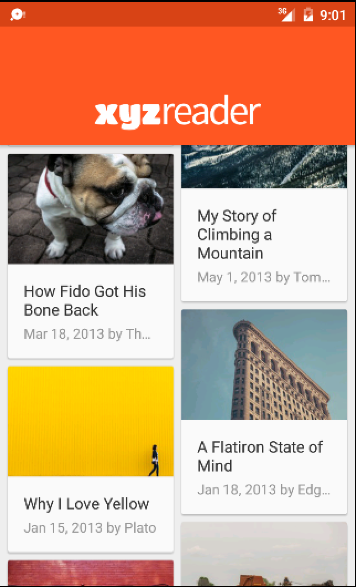

# XYZ Reader - Udacity Material Design Project
This project is part of Udacity Nanodegree. XYZ Reader is a mock RSS feed reader featuring banner photos and shocking headlines! Download base code [here](https://www.udacity.com/api/nodes/4292653440/supplemental_media/xyzreaderzip/download).
This UI app conforms to Material Design guidelines.

## Learning keys on this project:
	•	Understand the fundamentals of Android design.
	•	Apply Material Design guidelines to an mobile application.
	•	Separate an interface into surfaces.
	•	Effectively use transitions and motion.

## Install
1. Install Android Studio, make sure that the Android SDK Tools are properly installed.
2. Download or clone this repository and import it into Android Studio. 
3. Compile and run.

## Screenshots

## License
The content of this repository is licensed under a [Apache License, Version 2.0](http://www.apache.org/licenses/LICENSE-2.0)
